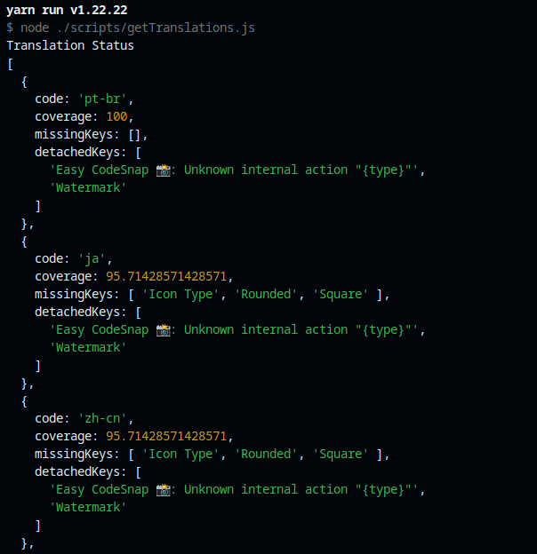

# Translation Guide

## Adding a New Translation

Translations are located in the `./l10n` folder and follow the naming pattern: `bundle.l10n.[code].json`.

To create a new translation, copy the file `bundle.l10n.pt-br.json` and rename it using the appropriate language code for your translation.

Next, replace the values in the file with the corresponding translations.

> If you can't translate all the keys but still want to contribute, that's totally fine! Just make sure to **remove any key-value pairs that still contain Brazilian Portuguese** — otherwise, those untranslated values will be published as-is.

Once your translation is ready, open a Pull Request and wait for it to be reviewed and accepted.

## Adding Missing Translations

After cloning the repository and installing the dependencies, follow these steps:

- Run `yarn translation-status`

Your terminal will display the status of all translations, like this:

This will help you identify the missing strings so you can add their corresponding translations.

Once you've added your translations, open a Pull Request and wait for it to be reviewed and accepted.
