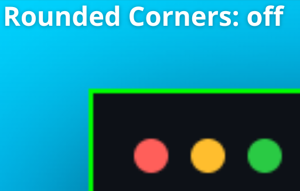
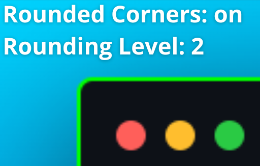
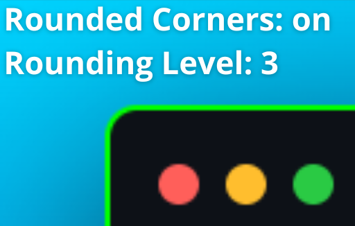
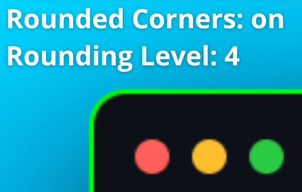

# Rounded Borders

To have rounded borders on `window`, you need to enable `Rounded Corners` (`easy-codesnap.roundedCorners`), otherwise your screenshot will be like this:

    

With `Rounded Corners` (`easy-codesnap.roundingLevel`) active, you can set the `Rounding Level` from `1` to `4`:

    
    

 

    
    

