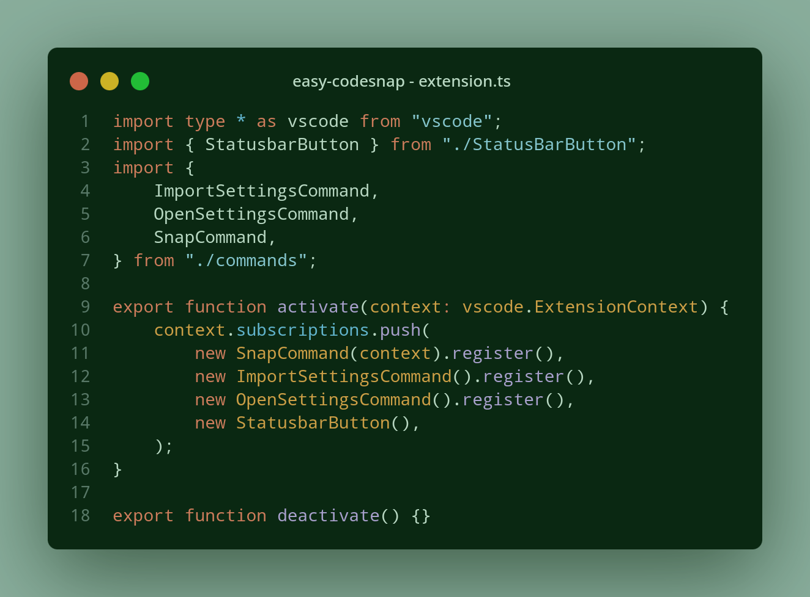
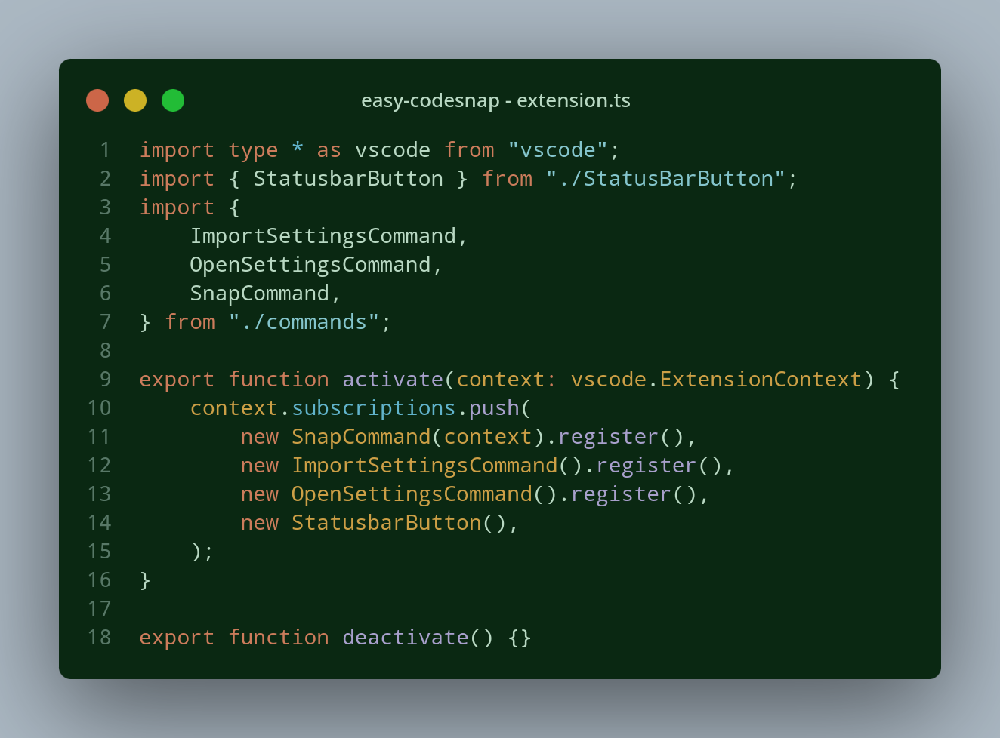

# Target

The target (`easy-codesnap.target`) only can be `container` or `window`.

When it's setted to be `container`, the screenshot will take all container area like this:

But, if you set target to `window`, the screenshot only will take the window area:

